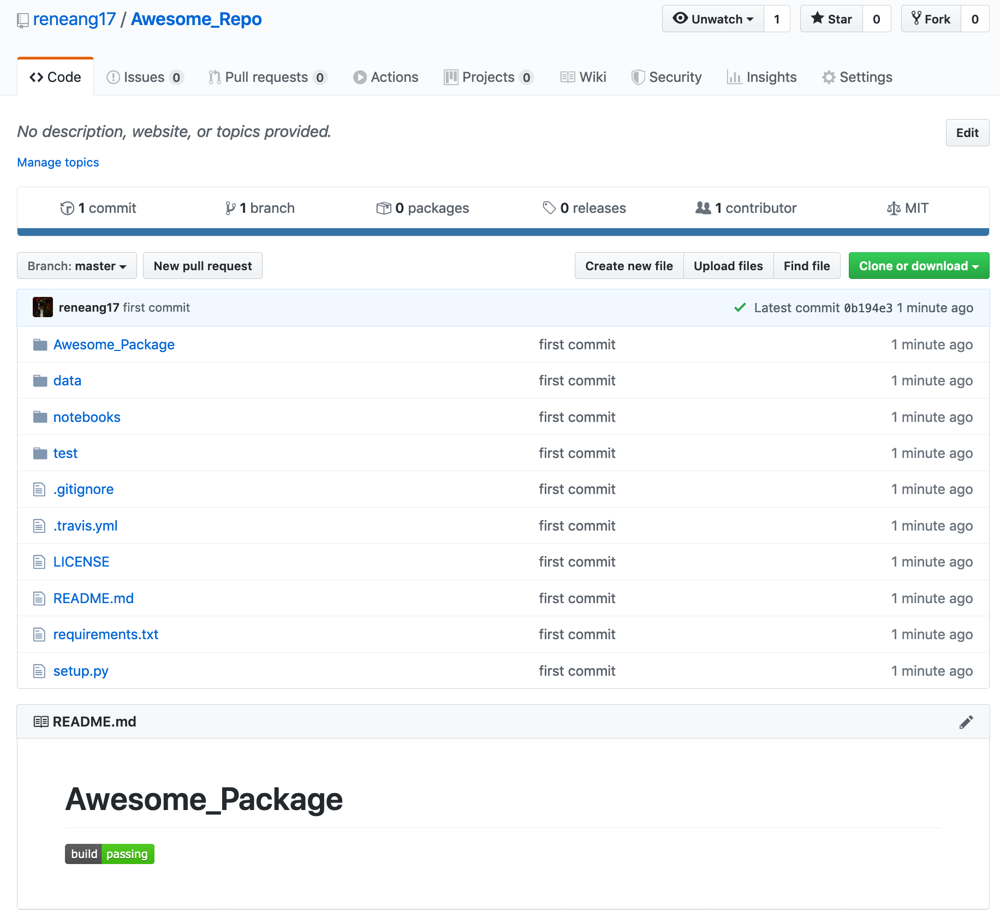

# Giter

My friend [Tom McClintock](https://github.com/tmcclintock) gives a seminar on his best 10 commits, that help
him start a data oriented project using best practices. I typed a script to execute these authomatically,
this way you can jump straight to your project. Enjoy!

This repo creates and commits for you a template to develope a python package on github.It features awesome development practices: test, setup.py, requirements.txt, and travis continuous integration support.

## Instributions 

0 .- (Only once) Fork and clone this repo to your local computer, 
open _git_starter.py, customize the following settings

git_username = 'your_github_username'

travis_user = 'your_travis_username'

author = 'your_name'

author_email = 'your_email'

add, commit, push. 

Every time you want to start a new project follow the next steps

1 .- Create a repo e.g. https://github.com/git_username/git_repo_name

2 .- (Optional) Added to the programs follow by travis (https://travis-ci.com/account/repositories)

3 .- Clone giter $git cone https://github.com/your_github_username/giter

4.- Finally run _git_starter.py parsing the following arguments

| Parameter  | Description | Default |
| ------------- | ------------- | ------------- |
| --git_repo_name | Repo name to commit to | No default |
| --package_name | The name you want for you package | No default | 
| --add_travis | Add .yml | True |
| --add_template | add notebooks and data dirs | True |

e.g.

$python _git_starter.py --git_repo_name Awesome_Repo --package_name Awesome_Package

voilà! you can go to https://github.com/git_username/git_repo_name and will find 
something like this:

